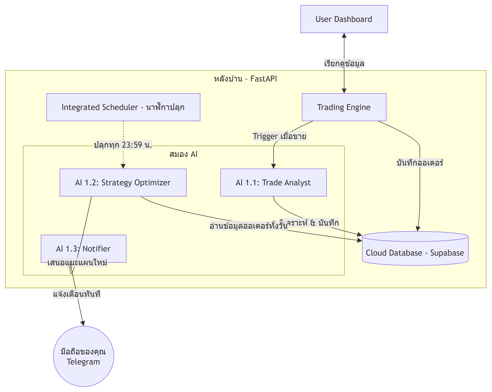

# 🚀 Forward Testing Platform (with Multi-Agent AI System)

ยินดีต้อนรับสู่โปรเจกต์ **Forward Testing Platform** ระบบจำลองการเทรดอัตโนมัติ (Paper Trading) แบบ Full-Stack ที่มาพร้อมกับระบบ AI อัจฉริยะแบบ Multi-Agent ที่คอยวิเคราะห์ เรียนรู้ และแจ้งเตือนคุณแบบอัตโนมัติ

เอกสารนี้เขียนขึ้นเพื่อให้ผู้ที่เริ่มต้น หรือไม่มีพื้นฐานโปรแกรมมิ่งสามารถทำความเข้าใจโครงสร้างทั้งหมดและสามารถรันโปรแกรม รวมถึงการเตรียมนำขึ้นระบบ Cloud ได้ด้วยตัวเองครับ

---

## 🏗️ โครงสร้างของโปรเจกต์ (Repository Overview)

โปรเจกต์นี้ถูกแบ่งออกเป็น 2 โฟลเดอร์หลัก ซึ่งทำงานแยกกันแต่คุยกันผ่านระบบเครือข่ายจำลอง (API):

1. **`frontend/` (ส่วนหน้าบ้าน):** 
   - สร้างด้วย **Next.js (React)** 
   - เป็นหน้าต่างเว็บไซต์ (Dashboard) ที่ให้คุณคลิกดูพอร์ตโฟลิโอ ดูกำไรขาดทุน และดูประวัติออเดอร์ต่างๆ ด้วยตาเปล่า
2. **`backend/` (ส่วนหลังบ้าน):** 
   - สร้างด้วย **FastAPI (Python)** 
   - เป็น "สมอง" ของระบบทั้งหมด คอยดึงราคาเหรียญ คำนวณจุดเข้าซื้อ/ขาย ตัดสินใจเทรด เป็นนาฬิกาปลุกในตัว และเป็นที่อยู่ของระบบ AI อัจฉริยะของเรา

---

## 🧠 สถาปัตยกรรมระบบ AI (AI Architecture)

ระบบนี้ไม่ได้มีแค่บอทเทรดโง่ๆ แต่เราได้ฝัง **AI ถึง 3 ตัว** ที่แบ่งหน้าที่กันทำงานเปรียบเสมือนบริษัทกองทุนขนาดย่อม:

1. **AI 1.1: Trade Analyst (นักวิเคราะห์ประจำวัน)**
   - **หน้าที่:** เมื่อบอทเทรดปิดออเดอร์ (ขาย) AI ตัวนี้จะตื่นขึ้นมาทันที มันจะเอาตัวเลขกำไร/ขาดทุน ไปเทียบกับ "ข่าวคริปโตล่าสุด" เพื่อสรุปว่า **"เราได้กำไรหรือขาดทุนเพราะอะไร?"** และบันทึกข้อสรุปลงฐานข้อมูล
2. **AI 1.2: Strategy Optimizer (ผู้จัดการกองทุน)**
   - **หน้าที่:** ไม่ได้ทำงานตลอดเวลา แต่มันจะถูกปลุกขึ้นมาทำงานตอน **23:59 น. ของทุกวัน**
   - มันจะกางประวัติออเดอร์ของวันนี้ทั้งหมดขึ้นมาดู เพื่อหา **"จุดบอดร่วมกัน"** (เช่น วันนี้ขาดทุนเพราะตั้ง Stop loss แคบไปช่วงข่าวแรง) และมันจะวิเคราะห์ว่าควรปรับแผน (Tune Parameter) หรือไม่
3. **AI 1.3: Backtester & Notifier (ผู้ช่วยและเลขา)**
   - **หน้าที่:** รับคำสั่งจากผู้จัดการ (AI 1.2) ถ้าผู้จัดการบอกว่า "ต้องแก้แผน" AI 1.3 จะทำการยิงข้อความ **แจ้งเตือนเข้า Telegram บนมือถือของคุณทันที** เพื่อให้คุณเข้ามาดูและตัดสินใจ

### 📊 แผนภาพการทำงาน (Architecture Diagram)



---

## 🛠️ วิธีการเปิดระบบ (Start Guide)

การรันโปรเจกต์นี้ คุณจำเป็นต้องเปิดเพียง 2 หน้าต่างพร้อมกัน (1 หน้าต่างสำหรับหน้าบ้าน, 1 สำหรับหลังบ้าน) 

### สิ่งที่ต้องเตรียมก่อนเริ่ม (ตั้งค่ารหัสผ่านและฐานข้อมูล)
ในโฟลเดอร์ `backend/` ให้สร้างไฟล์ชื่อ `.env` (คัดลอกรูปแบบจาก `.env.example`) แล้วใส่ข้อมูลลงไป:
```env
GEMINI_API_KEY="ใส่คีย์ Gemini ของคุณ"
TELEGRAM_BOT_TOKEN="ใส่คีย์ Telegram Bot ของคุณ"
TELEGRAM_CHAT_ID="ใส่ ID Telegram ของคุณ"
DATABASE_URL="ใส่ URL ฐานข้อมูลออนไลน์ (เช่น Supabase)"
```
*(คำแนะนำ: หากไม่ใส่ DATABASE_URL ระบบจะสร้างไฟล์ฐานข้อมูลจำลอง SQLite ในเครื่องให้ใช้อัตโนมัติ)*

### หน้าต่างที่ 1: เปิดการทำงานของหลังบ้าน (Backend Server)
1. เปิดโปรแกรม Terminal 
2. พิมพ์คำสั่งเพื่อเข้าไปในโฟลเดอร์หลังบ้าน:
   ```bash
   cd backend
   ```
3. ติดตั้งเครื่องมือที่จำเป็น (ทำแค่ครั้งแรกครั้งเดียว):
   ```bash
   pip install -r requirements.txt
   ```
4. เปิดเซิร์ฟเวอร์หลังบ้าน:
   ```bash
   python main.py
   ```
   *(หน้าต่างนี้ห้ามปิด! ระบบได้ฝังนาฬิกาปลุกไว้ในตัวแล้ว มันจะคอยรันบอทเทรดและปลุก AI ตามตารางเวลาอัตโนมัติ)*

### หน้าต่างที่ 2: เปิดหน้าเว็บไซต์ (Frontend)
1. เปิด Terminal **อันใหม่ขึ้นมาเป็นอันที่ 2**
2. พิมพ์คำสั่งเข้าโฟลเดอร์หน้าบ้าน:
   ```bash
   cd frontend
   ```
3. ติดตั้งเครื่องมือ (ทำแค่ครั้งแรกครั้งเดียว):
   ```bash
   npm install
   ```
4. เปิดเว็บไซต์:
   ```bash
   npm run dev
   ```
5. เปิด Google Chrome แล้วพิมพ์ที่อยู่ `http://localhost:3000` เพื่อดูหน้าตาเว็บไซต์ของคุณได้เลย!

---

## 🛑 วิธีการปิดระบบ (Stop Guide)
เมื่อคุณต้องการปิดระบบ ให้ไปที่หน้าต่าง Terminal ทีละอัน แล้วกดปุ่ม `Ctrl` ค้างไว้ ตามด้วยปุ่ม `C` ระบบจะหยุดทำงานครับ

---

## ☁️ คำแนะนำในการขึ้นระบบคลาวด์ (Cloud Deployment)

โปรเจกต์นี้ถูกปรับแต่งให้พร้อมนำไปขึ้น Cloud แบบฟรีได้ทันที:
1. **ฐานข้อมูล (Supabase / Neon):** นำลิงก์ที่ได้ไปใส่เป็น `DATABASE_URL` 
2. **เชื่อมต่อ Local กับ Cloud Database:** **คุณไม่ต้องเหนื่อยทำระบบ Sync ข้อมูลระหว่างคอมของคุณกับ Cloud!** วิธีปฏิบัติที่เป็นมาตรฐานระดับสากลคือ: ให้นำ `DATABASE_URL` ของ Cloud มาใส่ในไฟล์ `.env` บนเครื่องคอมของคุณเลยแบบนี้ เวลาคุณรันโค้ดทดสอบในคอม (Local) โค้ดจะดึงและบันทึกข้อมูลวิ่งตรงขึ้นไปบน Cloud Database เสมอ ทำให้ฐานข้อมูลของคุณ**มีข้อมูลล่าสุดและเป็นแหล่งความจริงเพียงแหล่งเดียว (Single Source of Truth) 100% ครับ**
3. **Backend (Render):** Deploy ผ่าน Render.com เป็นแบบ Web Service เพียงตัวเดียว (เพราะนาฬิกาปลุกรวมอยู่ในตัวแล้ว)
4. **Frontend (Vercel):** Deploy โฟลเดอร์ Frontend และตั้งค่าตัวแปร `NEXT_PUBLIC_API_URL` ให้ชี้ไปที่ลิงก์ของ Render

---

## ✨ ฟีเจอร์ล่าสุดที่ได้รับการอัปเดต (Recent Updates)
- **Modern UI & Tailwind CSS:** ปรับโฉมหน้าเว็บทั้งหมดด้วยดีไซน์แบบ Glassmorphism สวยงามล้ำสมัย พร้อมระบบ Loading Spinner แบบ Quantum อนิเมชั่น
- **Real-time Dashboard:** หน้าจอหลักจะดึงราคาเหรียญทุกๆ 3 วินาที และอัปเดตมูลค่าพอร์ตทุกๆ 5 วินาที ทำให้ตัวเลข PnL ขยับแบบเรียลไทม์
- **Advanced History Page:** 
  - เพิ่มแถบค้นหา (Search) ค้นหาจากชื่อเหรียญหรือวันเวลาได้ทันที
  - เพิ่มคอลัมน์ **Realized PnL** คำนวณกำไร/ขาดทุนเป็นดอลลาร์ให้แบบเป๊ะๆ 
  - แสดงผล "Detailed Decision Logic" ของ Gemini AI ในรูปแบบตารางที่อ่านง่ายสุดๆ
- **Dedicated AI Reports:** แยกหน้าสรุปผลของ AI 1.2 (Daily Optimizer) ออกมาเป็นหน้าเฉพาะตัวเพื่อไม่ให้รกหน้า History
- **Super Fast Performance:** แก้ปัญหาคอขวดของ Database (N+1 Query) และจำกัดการดึงประวัติให้อยู่ที่ 100 ไม้ล่าสุด ทำให้ทุกหน้าโหลดไวปานสายฟ้า

---

## 📡 รายการ API ของระบบ (API Endpoints)
ระบบสร้างจาก **FastAPI** คุณสามารถดูเอกสาร Swagger UI แบบเต็มๆ ได้ที่ `http://localhost:8000/docs`

**[General & System]**
- `GET /api/ping` - เช็คสถานะเซิร์ฟเวอร์ว่าเปิดอยู่หรือไม่
- `GET /market/prices` - ดึงราคาเหรียญล่าสุดจากตลาด (Market Data)

**[Portfolio & Trading]**
- `GET /portfolios` - ดึงรายชื่อพอร์ตโฟลิโอทั้งหมด พร้อมมูลค่าปัจจุบันและ Position ที่ถืออยู่ (โหลดเร็วเพราะไม่ได้รวมประวัติการเทรด)
- `GET /portfolios/{portfolio_id}` - ดึงข้อมูลพอร์ตโฟลิโอเฉพาะเจาะจง
- `GET /trades/{portfolio_id}` - ดึงประวัติการเทรด (จำกัด 100 ไม้ล่าสุดเพื่อประสิทธิภาพ) พร้อม **AI 1.1 Insights**
- `GET /engine_logs/{portfolio_id}` - ดึงบันทึก Log การทำงานของบอทเทรดในแต่ละรอบ
- `GET /optimization/{portfolio_id}` - ดึงรายงานสรุปผลการวิเคราะห์พอร์ตประจำวันจาก **AI 1.2 (Daily Optimizer)**

**[Manual Triggers]**
- `POST /engine/tick` - สั่งบังคับให้บอทเริ่มเช็คราคาและเทรดทันที 1 รอบ (ใช้สำหรับทดสอบ)
- `POST /engine/optimize_now` - สั่งบังคับให้ AI 1.2 เริ่มวิเคราะห์พอร์ตและสรุปรายงานประจำวันทันที (ไม่ต้องรอ 23:59)

